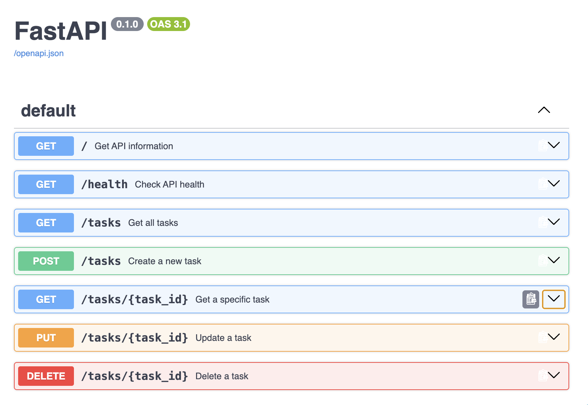
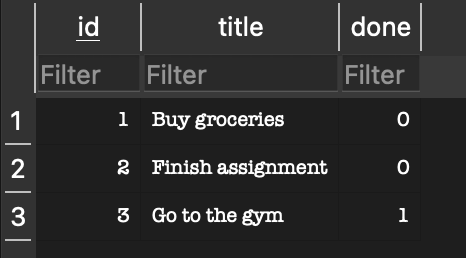

# Task API

A simple REST API for managing a to-do list, built with Python and FastAPI.

## Features

The API supports CRUD operations for tasks:

- Create a new task
- Read all tasks
- Read a specific task
- Update an existing task
- Delete a task

## Installation and Running

Create and activate a virtual environment:

```bash
python3 -m venv venv
source venv/bin/activate
```

Install the required packages:

```bash
pip install fastapi uvicorn
```

Run the API:

```bash
uvicorn main:app --reload
```

The API will be available at:

`http://127.0.0.1:8000`

Swagger documentation is available at:

`http://127.0.0.1:8000/docs`

## API Endpoints

| Method | Endpoint | Description |
|---|---|---|
| GET | `/` | Get API information |
| GET | `/health` | Check API health |
| GET | `/tasks` | Get all tasks |
| GET | `/tasks/{task_id}` | Get a specific task |
| POST | `/tasks` | Create a new task |
| PUT | `/tasks/{task_id}` | Update an existing task |
| DELETE | `/tasks/{task_id}` | Delete a task |

## Example

Create a new task using `curl`:

```bash
curl -i -X POST http://127.0.0.1:8000/tasks \
-H "Content-Type: application/json" \
-d '{"title":"Buy milk"}'
```

Example response:

```text
HTTP/1.1 201 Created
date: Wed, 16 Sep 2026 00:16:01 GMT
server: uvicorn
content-length: 40
content-type: application/json

{"id":4,"title":"Buy milk","done":false}%   
```

## Swagger UI

FastAPI automatically generates interactive API documentation using Swagger UI.

To access it while the server is running, open:

`http://127.0.0.1:8000/docs`

The Swagger UI can be used to test the full CRUD cycle directly from the browser.

### Swagger Screenshot



## Status Codes

The API uses the following HTTP status codes:

| Status Code | Meaning |
|---|---|
| `200 OK` | A task was successfully read or updated |
| `201 Created` | A new task was successfully created |
| `204 No Content` | A task was successfully deleted |
| `400 Bad Request` | Invalid task data was provided |
| `404 Not Found` | The requested task ID does not exist |

## Technologies Used

- Python
- FastAPI
- Uvicorn
- Pydantic
- Swagger UI
- Git and GitHub

## Notes

Tasks are stored in memory rather than in a database. This means that any tasks created, updated, or deleted while the API is running will reset when the server is restarted.

## Exploring the Database with SQL

I used DB Browser for SQLite to inspect and modify the task database directly.

Example query:

```sql
SELECT * FROM tasks WHERE done = 1;
```

One formatting note: because that contains a code block inside what I'm showing you, make sure the final README visually looks like:

**Exploring the Database with SQL**

I used DB Browser for SQLite to inspect and modify the task database directly.

**Example query:** `SELECT * FROM tasks WHERE done = 1;`

This query returns all tasks that have been marked as completed.

Save `README.md` and tell me **done**. Then we'll commit **Stage 4: explored SQLite** and move to the final Stage 5.

## SQLite Database

This API uses SQLite for persistent data storage. SQLite was chosen because it is lightweight, requires no separate database server or setup, and stores the database in a single file while allowing task data to survive application restarts.

The database is stored locally as `tasks.db` in the project root. The file is automatically created when the application starts if it does not already exist. It is excluded from Git using `.gitignore`, allowing a fresh database to be created when the repository is cloned.

On first startup, the application automatically creates the `tasks` table and seeds it with three example tasks if the table is empty.

### Start the API

Activate the virtual environment:

```bash
source venv/bin/activate
```

Start the server:

```bash
uvicorn main:app --reload
```

The API will be available at `http://127.0.0.1:8000`.

### Database Preview



### Example SQL Query

```sql
SELECT * FROM tasks WHERE done = 1;
```

This query returns all tasks that have been marked as completed.

## PostgreSQL with Docker

For this stage, PostgreSQL runs inside a Docker container.

Start the PostgreSQL container with:

```bash
docker run --name task-postgres \
  -e POSTGRES_USER=taskuser \
  -e POSTGRES_PASSWORD=taskpass \
  -e POSTGRES_DB=taskdb \
  -p 5432:5432 \
  -v taskdata:/var/lib/postgresql/data \
  -d postgres:16
```

The container creates a PostgreSQL database named `taskdb`. The `tasks` table contains the same task data used by the API in the previous SQLite stage.

## Docker and PostgreSQL

The API has been migrated from SQLite to PostgreSQL and containerized using Docker. Docker Compose runs both the FastAPI application and PostgreSQL database together.

### Run with Docker Compose

Make sure Docker Desktop is running, then start the complete stack with:

```bash
docker compose up --build
```

The API will be available at:

`http://localhost:8000`

Swagger documentation is available at:

`http://localhost:8000/docs`

To stop the containers:

```bash
docker compose down
```

### Services

The Docker Compose configuration contains two services:

- `api` — the FastAPI application
- `db` — the PostgreSQL database

The API connects to PostgreSQL using the `DATABASE_URL` environment variable.

### Database Persistence

PostgreSQL data is stored in a named Docker volume. This means task data persists when the containers are stopped and restarted with:

```bash
docker compose down
docker compose up -d
```

### Environment Variables

Database configuration is provided through environment variables. An `.env.example` file is included as a template.

The real `.env` file is excluded from Git so database credentials are not committed to the repository.